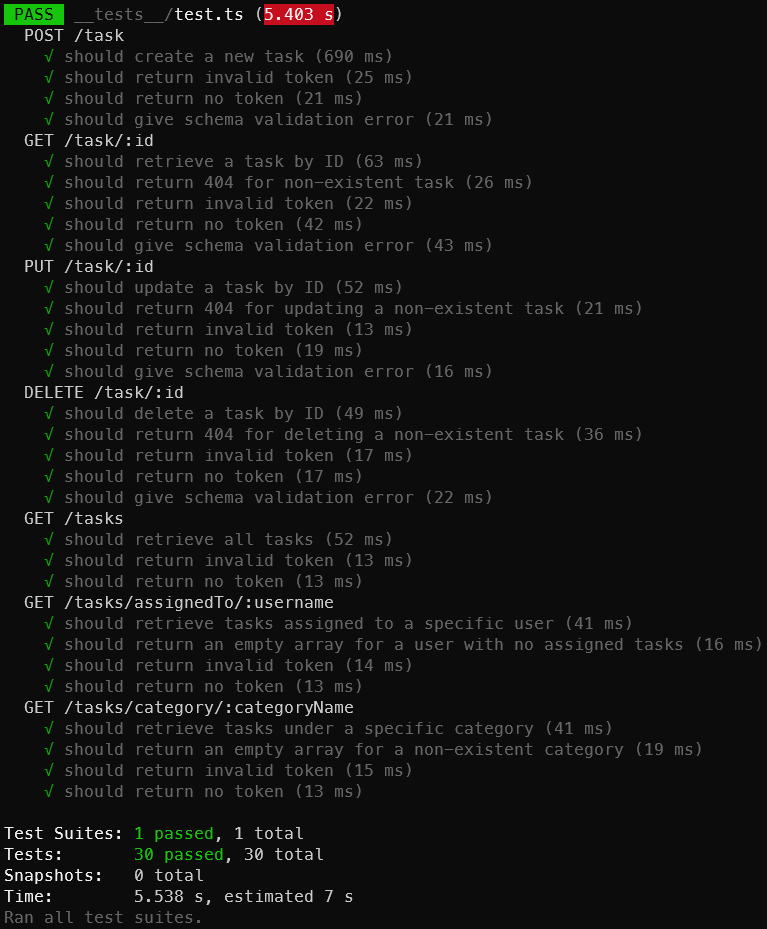

# NCLE Backend API

This contains all the API implementation

# About the project implementation

## Tech Stack

- Backend Framework: Express.js
- Database: Mongodb @ ATLAS
- ODM: Mongoose
- Validator: Joi
- Test: Jest & Supertest
- Test DB: mongodb-memory-server

## Features Implemented 👨‍💻

- POST `/task` - Create a new task. ✔
- GET `/task/:id` - Retrieve a task by its ID. ✔
- PUT `/task/:id` - Update a specific task. ✔
- DELETE `/task/:id` - Delete a specific task. ✔
- GET `/tasks` - Retrieve all tasks. ✔
- GET `/tasks?assignedTo=[username]` - Retrieve all tasks assigned to a specific user. ✔
- GET `/tasks?category=[categoryName]` - Retrieve all tasks under a specific category. ✔

## Bonus Features Implemented 😎

- Implement user authentication. ✔
- Implement pagination for the GET `/tasks` route. ✔

## Extra Bonus Features Implemented 🤩

- Added Joi Schema Validation ✔
- Added Sorting for GET `/tasks` api ✔


## Run Locally

Clone the project

```bash
 git clone <Repo URL>
```

Go to the project directory

```bash
  cd ncle-be
```

Install dependencies

```bash
  npm install
```

Start the server:

this command will automatically start express server.

```bash
  npm run dev
```

## Run Using Docker

- Download the file i.e. docker-compose.yml
- Run docker compose -f "docker-compose.yml" up -d --build
- This will spin up container
  - tejasog/nclebe : running on localhost:3000  
- Head to http://localhost:3000 in browser or postman to access the API Server
- Once done testing run docker compose -f "docker-compose.yml" down to close & remove the containers.

API server

```bash
http://localhost:3000/
```


## API Reference

Visit this postman collection for all API Documentation

 
Link: [API Documentation](https://documenter.getpostman.com/view/1500291/2s9YR3dFfV#d59b6521-0032-4304-8de7-9490554ddec6)


To run tests

`npm run test`


**Current Test Case Result:**


[](https://github.com/tejassrivastava/ncle-be/blob/main/TestResultNcle.png)

**Current Test Coverage Result:**

[](https://github.com/tejassrivastava/ncle-be/blob/main/TestCoverageNcle.png)

## Authors

- [@tejassrivastava](https://www.github.com/tejassrivastava)
